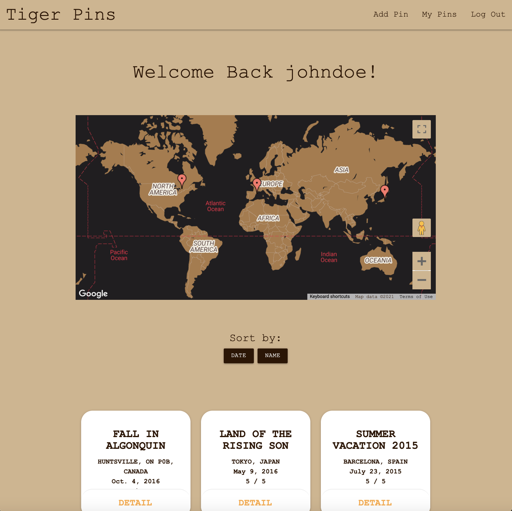

# Tigerpins 
Tigerpins is a full-stack web application that allows users to log and recall places they've been to, and take a look at places that others users have been to. Users are able to see all of their locations visually pinned on a map and are able to explore their notes of any location but selecting any pin on the map.

** Note that the tigerpins heroku name was lost recently when heroku switched to paid dynos, this is now hosted at [tigerpin (https://tigerpin.herokuapp.com/) **

## Getting Started

https://tigerpin.herokuapp.com/

https://trello.com/b/bYoQYg7j/tigerpins

## Technologies used

Languages: HTML, CSS, JavaScript, Python

Tech: Django (back-end server), Materialize (CSS framework), Google Maps (API)

## Screenshots

## Icebox
- Allow for users to add friends and request contact info.
- Allow other users to comment on pins created by other users.
